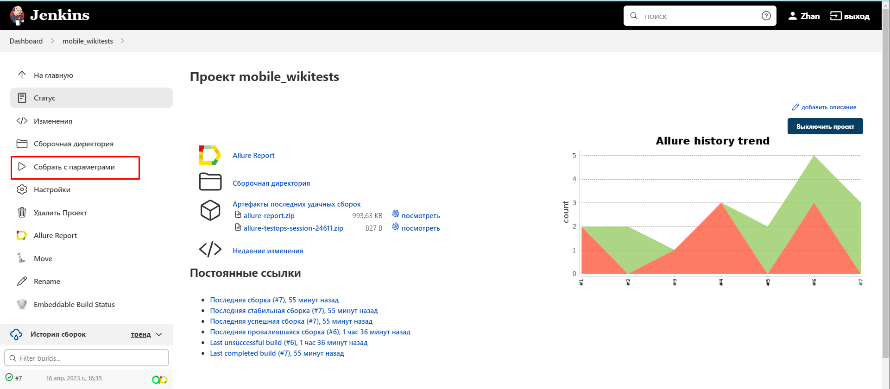
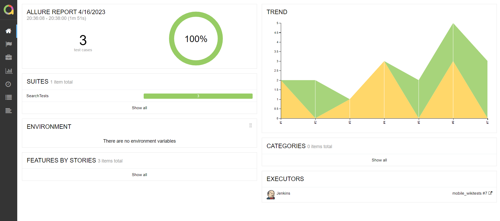
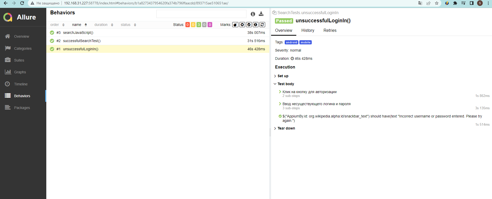
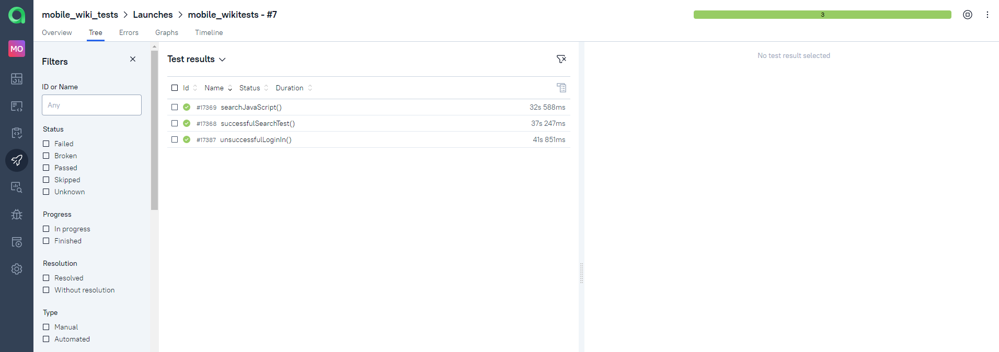
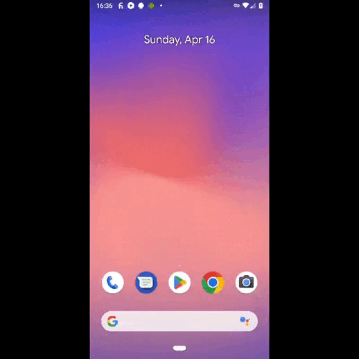

# Проект по мобильной автоматизации


## :bookmark_tabs: Содержание:

- [Использованный стек технологий](#computer-использованный-стек-технологий)
- [Реализованный проверки](#реализованный-проверки)
- [Запуск тестов](#running_woman-запуск-тестов)
- [Сборка в Jenkins](#-сборка-в-jenkins)
- [Пример Allure-отчета](#-пример-allure-отчета)
- [Уведомления в Telegram с использованием бота](#-уведомления-в-telegram-с-использованием-бота)

___
## :computer: Использованный стек технологий

<p align="center">


</p>

Автотесты написаны на <code>Java</code> с использованием <code>JUnit 5</code> и <code>Gradle</code>.
Для тестов для мобильного приложения использован фреймворк [Appium](https://appium.io/).
Запуск тестов можно осуществлять локально или удаленно.
Также реализована сборка в <code>Jenkins</code> с формированием Allure-отчета.

Allure-отчет включает в себя:
* Шаги выполнения тестов;
* Скриншот страницы в браузере в момент окончания автотеста;
* Page Source;
* Логи браузерной консоли;

___

## :bookmark: Запуск тестов из терминала

Локальный запуск:
```
gradle local -Denv-local
```

Удаленный запуск:
```
gradle android -Dnev=android
gradle android -Dnev=ios
```

## :computer: Получение отчёта


```
allure serve build/allure-results
```
___

###  Сборка в Jenkins

* Для запуска необходимо нажать на "Собрать c параметрами"

<p align="center">

</p>

###  Пример Allure-отчета удаленного запуска автотестов


<p align="center">

</p>


###  Пример Allure-отчета локального запуска автотестов


<p align="center">

</p>

___
###  Результат выполнения теста

<p align="center">

</p>

###  Видео примера запуска автотеста

Далее представлено видео прохождения теста на неуспешную авторизацию в мобильном приложении Wikipedia
<p align="center">
  
</p>

